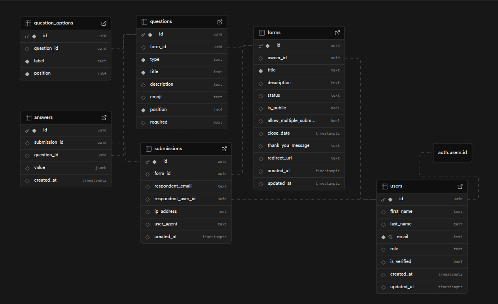

<div align="center">
  
</div>

Craft is a modern, premium form builder designed for creating surveys, quizzes, and data collection forms with ease. It offers a focused, distraction-free environment for both form creators and respondents.

## 🚀 Features

- **Intuitive Form Builder**: Drag-and-drop interface for building complex forms.
- **Real-time Preview**: See exactly how your form looks before publishing.
- **Submission Management**: Comprehensive dashboard to view and analyze responses.
- **Admin Control**: Robust admin panel for managing users and global form settings.
- **Secure Authentication**: Integrated with Supabase for secure Email/Password and Google OAuth.
- **RBAC**: Role-Based Access Control to manage permissions across the platform.
- **Responsive Design**: Fully responsive interface for a seamless experience on all devices.

## 🛠️ Tech Stack

- **Frontend**: React, Vite, Tailwind CSS, Lucide React, Framer Motion.
- **Backend**: Go (1.25+), Fiber v3.
- **Database & Auth**: Supabase (PostgreSQL).

## 📦 Database Schema

<div align="center">
  
</div>

<details>
   <summary>DB schema details</summary>
   
   ```sql
   create extension if not exists "pgcrypto";
   create extension if not exists "uuid-ossp";

   create or replace function update_updated_at_column()
   returns trigger as $$
   begin
   new.updated_at = now();
   return new;
   end;
   $$ language plpgsql;

   create table public.users (
   id uuid primary key references auth.users(id) on delete cascade not null,

   first_name text,
   last_name text,

   email text not null unique,
   role text default 'user',

   is_verified boolean default false,

   created_at timestamptz default now(),
   updated_at timestamptz default now()
   );

   create trigger update_users_updated_at
   before update on public.users
   for each row
   execute function update_updated_at_column();

   create or replace function public.handle_new_user()
   returns trigger as $$
   begin
   insert into public.users (id, email, first_name, last_name, role, is_verified)
   values (
      new.id,
      new.email,
      coalesce(new.raw_user_meta_data->>'first_name', ''),
      coalesce(new.raw_user_meta_data->>'last_name', ''),
      coalesce(new.raw_user_meta_data->>'role', 'user'),
      new.email_confirmed_at is not null
   );
   return new;
   end;
   $$ language plpgsql security definer;

   drop trigger if exists on_auth_user_created on auth.users;

   create trigger on_auth_user_created
   after insert on auth.users
   for each row
   execute function public.handle_new_user();

   create table forms (
   id uuid primary key default gen_random_uuid(),
   owner_id uuid references public.users(id) on delete cascade,

   title text not null,
   description text,

   status text default 'draft', -- draft | published | closed
   
   is_public boolean default false,
   allow_multiple_submissions boolean default false,
   close_date timestamptz,
   thank_you_message text,
   redirect_url text,

   created_at timestamptz default now(),
   updated_at timestamptz default now(),
   
   constraint valid_form_status check (status in ('draft', 'published', 'closed'))
   );

   create trigger update_forms_updated_at
   before update on forms
   for each row
   execute function update_updated_at_column();

   create table questions (
   id uuid primary key default gen_random_uuid(),
   form_id uuid references forms(id) on delete cascade,

   type text not null,

   title text not null,
   description text,
   
   emoji text,

   position integer not null,
   required boolean default false,
   
   constraint valid_question_type check (
      type in ('short-text', 'long-text', 'single-select', 'multi-select', 'dropdown')
   )
   );

   create table question_options (
   id uuid primary key default gen_random_uuid(),
   question_id uuid references questions(id) on delete cascade,

   label text not null,
   position integer not null
   );

   create table submissions (
   id uuid primary key default gen_random_uuid(),
   form_id uuid references forms(id) on delete cascade,
   
   respondent_email text,
   respondent_user_id uuid references public.users(id) on delete set null,
   ip_address inet,
   user_agent text,

   created_at timestamptz default now()
   );

   create table answers (
   id uuid primary key default gen_random_uuid(),
   submission_id uuid references submissions(id) on delete cascade,
   question_id uuid references questions(id) on delete cascade,

   -- JSONB to support both single and multi-select answers
   value jsonb,
   
   created_at timestamptz default now()
   );

   create index on forms(owner_id);
   create index on forms(status, is_public); -- For public form queries
   create index on questions(form_id, position);
   create index on question_options(question_id, position);
   create index on submissions(form_id);
   create index on submissions(respondent_email); -- For respondent lookups
   create index on submissions(respondent_user_id); -- For user submission tracking
   create index on answers(submission_id);
   create index on answers(question_id); -- For answer analytics

   alter table public.users enable row level security;
   alter table forms enable row level security;
   alter table questions enable row level security;
   alter table question_options enable row level security;
   alter table submissions enable row level security;
   alter table answers enable row level security;

   -- =========================
   -- RLS POLICIES
   -- =========================

   create policy "Users manage own profile"
   on public.users
   for all
   using (id = auth.uid());

   create policy "Users manage own forms"
   on forms
   for all
   using (owner_id = auth.uid());

   create policy "Public can view published forms"
   on forms
   for select
   using (status = 'published' and is_public = true);

   create policy "Users manage own questions"
   on questions
   for all
   using (
   form_id in (
      select id from forms where owner_id = auth.uid()
   )
   );

   create policy "Public can view published form questions"
   on questions
   for select
   using (
   form_id in (
      select id from forms where status = 'published' and is_public = true
   )
   );

   create policy "Users manage own question options"
   on question_options
   for all
   using (
   question_id in (
      select q.id
      from questions q
      join forms f on f.id = q.form_id
      where f.owner_id = auth.uid()
   )
   );

   create policy "Public can view published form options"
   on question_options
   for select
   using (
   question_id in (
      select q.id
      from questions q
      join forms f on f.id = q.form_id
      where f.status = 'published' and f.is_public = true
   )
   );

   create policy "Public can submit forms"
   on submissions
   for insert
   with check (true);

   create policy "Owners can view submissions"
   on submissions
   for select
   using (
   form_id in (
      select id from forms where owner_id = auth.uid()
   )
   );

   create policy "Public can submit answers"
   on answers
   for insert
   with check (true);

   create policy "Owners can view answers"
   on answers
   for select
   using (
   submission_id in (
      select s.id
      from submissions s
      join forms f on f.id = s.form_id
      where f.owner_id = auth.uid()
   )
   );
   ```
</details>

---

## ⚙️ Setup Guide

### Prerequisites

- [Go](https://golang.org/doc/install) (v1.25 or later)
- [Node.js](https://nodejs.org/en/download/) (v18 or later)
- [Supabase Account](https://supabase.com/)

### 1. Backend Setup

1. Navigate to the backend directory:
   ```bash
   cd craft-backend
   ```

2. Install dependencies:
   ```bash
   go mod tidy
   ```

3. Configure environment variables:
   ```bash
   cp .env.example .env
   ```
   Fill in your Supabase credentials in the `.env` file:
   - `PUBLISH_KEY`
   - `SECRET_KEY`
   - `ANON_KEY`
   - `DATABASE_URL`
   - `PROJECT_URL`

4. Run the backend:
   ```bash
   make run
   # Or for hot reload (requires 'air'):
   make watch
   ```

### 2. Frontend Setup

1. Navigate to the root directory:
   ```bash
   cd ..
   ```

2. Install dependencies:
   ```bash
   npm install
   ```

3. Configure environment variables:
   ```bash
   cp .env.example .env
   ```
   Fill in the following:
   - `CALLBACK_URL` (e.g., http://localhost:5173/auth/callback)
   - `CLIENT_ID` (Google OAuth Client ID)
   - `CLIENT_SECRET` (Google OAuth Client Secret)
   - `VITE_API_BASE_URL` (e.g., http://localhost:8080/api/v1)

4. Run the frontend:
   ```bash
   npm run dev
   ```

---
